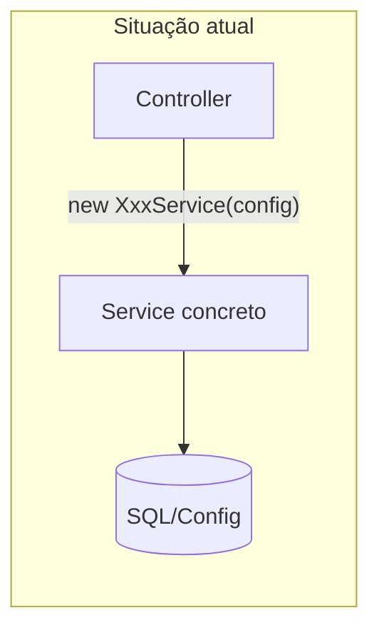
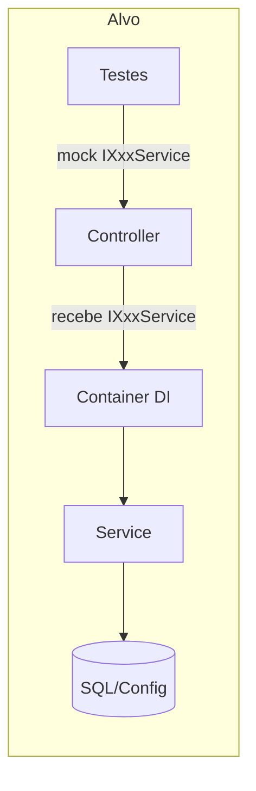

# Plano: Deixar Poliview.crm.api testável com boas práticas .NET Core

**Visão geral:** Tornar a Poliview.crm.api testável aplicando injeção de dependência nos controllers (em vez de instanciar serviços com `new`), registrar serviços no container em Program.cs, externalizar configuração JWT e, se necessário, criar projeto de testes e abstração para ParametrosService.

---

## Situação atual

- **Controllers** recebem apenas `IConfiguration` e instanciam os serviços no construtor com `new XxxService(configuration)` (ex.: InfoController.cs, ChamadoController.cs). A única exceção é o TelegramController.cs, que já recebe `ITelegramService` por DI.
- **Program.cs** não registra os serviços da camada `Poliview.crm.services` no container; por isso os controllers criam as implementações manualmente.
- **Chave JWT** está hardcoded em Program.cs (linhas 79-81), o que dificulta testes e é um risco de segurança.
- **ParametrosService** é uma classe estática (ParametrosService.cs); usada em ParametrosController e em ações de MensagemController e ArquivoDownloadController, além de dentro de BoletoService e GerarPdfService.
- No **Poliview.crm.services** já existem interfaces para a maioria dos serviços (IInfoService, IChamadoService, IAutenticacaoService, etc.); elas simplesmente não são usadas pela API.

---

## 1. Registrar serviços no container (Poliview.crm.api)

**Arquivo:** Poliview.crm.api/Program.cs

- Adicionar registros **Scoped** (ou Transient, conforme ciclo de vida desejado) para cada par interface → implementação usada pelos controllers, por exemplo:
  - `IInfoService` → `InfoService`
  - `IChamadoService` → `ChamadoService`
  - `IAutenticacaoService` → `AutenticacaoService`
  - E os demais: Acesso, ArquivoDownload, Bloco, Boleto, ConfigCrm, ContaEmail, Empreendimento, Empresa, GerarPdf, Grupo, GrupoMidia, Historico, Mensagem, Notificacao, OcorrenciasAberturaChamado (IOcorrenciasAberturaChamadoService), Recurso, Servicos (IServicosService), TipoUnidade, Unidade, Upload, Usuario.
- Todas as implementações recebem `IConfiguration`; o container injeta `IConfiguration` automaticamente.
- **Sugestão:** criar um método de extensão em um novo arquivo, por exemplo `Poliview.crm.api/Extensions/ServiceCollectionExtensions.cs`, com algo como `AddApplicationServices(this IServiceCollection services)`, e chamar `builder.Services.AddApplicationServices();` no Program.cs para manter Program.cs limpo e o registro testável/reutilizável.

---

## 2. Externalizar configuração JWT (Poliview.crm.api)

**Arquivo:** Poliview.crm.api/Program.cs e Poliview.crm.api/appsettings.json.

- Mover Issuer, Audience e chave de assinatura para `appsettings.json` (por exemplo seção `Jwt` ou `Authentication:JwtBearer`).
- No Program.cs, usar `builder.Configuration` para ler essas chaves (e `IssuerSigningKey` a partir da chave em base64 ou texto).
- Em ambiente de teste, usar `appsettings.Test.json` ou configuração em memória para não depender da chave de produção e permitir testes de autorização.

---

## 3. Alterar controllers para receber interfaces por construtor (Poliview.crm.api)

**Arquivos:** todos os controllers em Poliview.crm.api/Controllers/.

- Para cada controller que hoje faz `_service = new XxxService(configuration)`:
  - Alterar o construtor para receber a interface correspondente (ex.: `IInfoService infoService`) e atribuir ao campo.
  - Remover a dependência de `IConfiguration` do construtor quando ela for usada apenas para criar o serviço.
- **Casos especiais:**
  - **ParametrosController:** hoje usa `ParametrosService.consultar(_connectionString)` estático. Opções: (A) criar `IParametrosService` + implementação que encapsula a chamada estática e injetar em ParametrosController; ou (B) deixar ParametrosController como está na primeira fase e apenas garantir que os outros controllers fiquem testáveis.
  - **MensagemController e ArquivoDownloadController:** usam `new ParametrosService(_configuration).consultar()` dentro de uma action (linhas 345 e 263). Se for criado `IParametrosService`, injetá-lo nesses controllers e usar em vez da chamada estática/instância local.

**Lista de controllers a ajustar (construtor):** AcessoController, ArquivoDownloadController, AutenticacaoController, BlocoController, BoletoController, ChamadoController, ConfigCrmController, ContaEmailController, EmpreendimentoController, EmpresaController, GerarPdfController, GrupoController, GrupoMidiaController, HistoricoController, InfoController, MensagemController, NotificacaoController, OcorrenciaController, RecursoController, ServicosController, TipoUnidadeController, UnidadeController, UploadController, UsuarioController. ParametrosController e possivelmente MensagemController/ArquivoDownloadController conforme decisão sobre ParametrosService.

---

## 4. ParametrosService testável (Poliview.crm.services + API)

**Arquivos:** Poliview.crm.services/ParametrosService.cs e possivelmente novo arquivo na API ou em services.

- **Opção A (recomendada para testabilidade):** Criar interface `IParametrosService` em Poliview.crm.services com métodos que espelhem os atuais (ex.: `Consultar()`, `ConsultarEspacoCliente(string cpf)`, `BotaoLogin()`). Criar classe `ParametrosServiceImplementation` (ou renomear a estática para `ParametrosServiceStatic` e nova classe `ParametrosService` que implementa a interface e delega para os estáticos) que recebe `IConfiguration` ou connection string no construtor. Registrar `IParametrosService` → implementação no container da API. Atualizar ParametrosController, MensagemController e ArquivoDownloadController para receber `IParametrosService`. Nos serviços que chamam `ParametrosService.consultar(_connectionString)` (ex.: BoletoService, GerarPdfService), injetar `IParametrosService` se for possível sem refatoração grande; caso contrário, manter chamada estática na primeira fase.
- **Opção B (mínima):** Não criar interface para parâmetros na primeira etapa; apenas deixar ParametrosController e as actions que usam ParametrosService como estão, e focar em tornar os demais controllers testáveis.

---

## 5. Ajustes pontuais em Program.cs

- Remover a segunda chamada `builder.Services.AddControllers();` (redundante).
- Manter `ConsoleLogService` como Singleton; em testes de integração com `WebApplicationFactory` o host usa o Program.cs real. Para testes unitários de controllers (sem subir o host), o ConsoleLogService não é resolvido nos controllers; apenas em testes que configuram o host pode ser útil mockar. Opcional: extrair interface `IConsoleLogService` e registrar implementação, para permitir mock em testes de integração.

---

## 6. Projeto de testes (se não existir)

- **Criar** projeto de testes (ex.: Poliview.crm.Testes ou Poliview.crm.api.Tests) com xUnit (e opcionalmente Moq, FluentAssertions), referenciando Poliview.crm.api.
- **Expor Program.cs para testes:** em projetos .NET 6+, é necessário adicionar `public partial class Program { }` em algum arquivo da API (por exemplo Program.cs ou Poliview.crm.api/Program.Expose.cs) para que `WebApplicationFactory<Program>` funcione.
- **Testes unitários de controllers:** criar um controller de exemplo (ex.: InfoController), mockar `IInfoService` (retorno controlado para `execute()`), configurar o host de teste com `WebApplicationFactory` ou com `new ServiceCollection()` + registro do mock + instanciação do controller, e afirmar que a ação retorna 200 e o corpo esperado.
- **Testes de integração (opcional):** usar `WebApplicationFactory<Program>` e, se necessário, banco em memória ou connection string de teste para testes que dependem de serviços reais.

---

## 7. Ordem sugerida de implementação

1. Externalizar JWT para appsettings e ajustar Program.cs (leitura da config).
2. Criar método de extensão e registrar todos os serviços (interface → implementação) no container.
3. Alterar controllers um a um para receber a interface no construtor (começar por InfoController e ChamadoController como piloto).
4. Decidir e implementar Opção A ou B para ParametrosService; atualizar ParametrosController (e Mensagem/ArquivoDownload se Opção A).
5. Remover `AddControllers()` duplicado e revisar Program.cs.
6. Criar projeto de testes e pelo menos um teste de controller com mock de IInfoService (e expor `Program` se usar WebApplicationFactory).

---

## Resumo dos arquivos impactados

| Projeto / pasta       | Arquivos                                                                                                                           |
| --------------------- | ---------------------------------------------------------------------------------------------------------------------------------- |
| Poliview.crm.api      | Program.cs, appsettings.json, novo Extensions/ServiceCollectionExtensions.cs (ou equivalente), todos os controllers listados acima |
| Poliview.crm.services | ParametrosService (e novo IParametrosService + implementação se Opção A)                                                           |
| Novo/criar             | Poliview.crm.Testes (ou similar) com csproj, InfoControllerTests (ou equivalente), possivelmente appsettings.Test.json             |

Nenhuma alteração é necessária nos projetos **Poliview.crm.http.service**, **Poliview.crm.infra** ou **Poliview.crm.models** para que a API fique testável; a mudança é na forma como a API resolve e usa os serviços (DI em vez de `new`).
