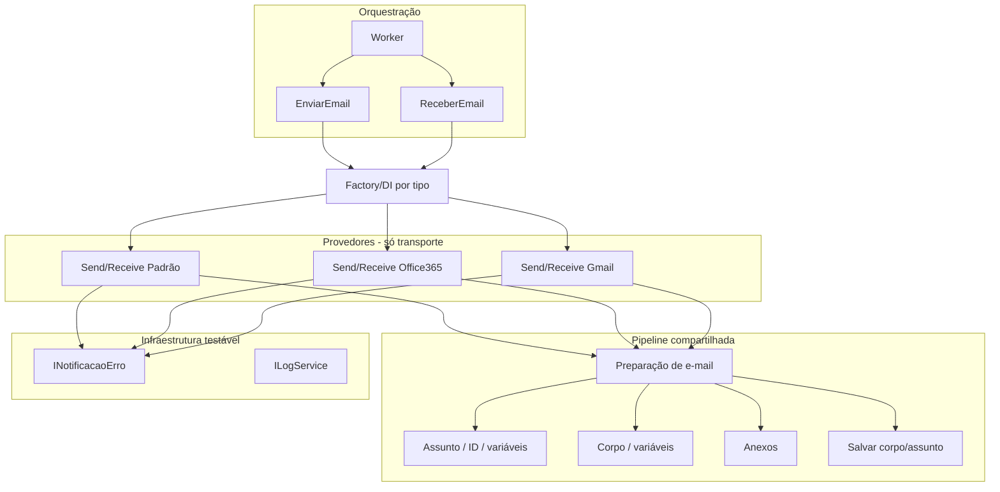

# Análise e planejamento: poliview.crm.service.email

Refatoração para legibilidade, remoção de redundância e testabilidade. O projeto envia e recebe e-mail por **três provedores**: POP/SMTP (padrão), Office 365 API e Gmail API.

---

## 1. Situação atual

### 1.1 Estrutura do projeto

- **Worker.cs** – ciclo principal: lista contas, chama EnviarEmail e ReceberEmail por conta, trata erros e notificação Telegram.
- **EnviarEmail.cs** – orquestra envio: obtém pendentes via EmailService, escolhe implementação por `tipoAutenticacao` (switch) e chama `ISendEmailService.SendEmailAsync`.
- **ReceberEmail.cs** – orquestra recebimento: inicia/para recebimento no EmailService, escolhe implementação por `tipoAutenticacao` e chama `IReceiveEmailService.ReceiveEmailAsync`.
- **Services/**
  - **Send:** SendEmailPadraoService, SendEmailOffice365Service, SendEmailGmailService (implementam ISendEmailService).
  - **Receive:** ReceiveEmailPadraoService, ReceiveEmailOffice365Service, ReceiveEmailGmailService (implementam IReceiveEmailService).
  - **ReceiveEmailService.cs** – interface IReceiveEmailService + classe estática ProcessarEmailsRecebidos.
  - **SendEmailService.cs** – apenas interface ISendEmailService.
  - **UtilEmailServices.cs** – métodos estáticos (TrocaVariaveisTexto, anexos, notificação Telegram, etc.).

### 1.2 Redundância identificada

| Onde | O quê |
|------|--------|
| **Construtor e campos em todos os 6 serviços** | Mesmos campos: `connection`, `configuration`, `_logService`, `verQuery`, `verDebug`, `verErros`, `verInfos`, `_cliente`, `_tituloMensagem`. Mesma leitura de config. |
| **Preparação do e-mail antes de enviar** | Nos 3 Send*: tratamento "RECUPERAÇÃO DE SENHA", RetiraIdEmaildoAssunto, IncluirIdEmailNoAssunto, ExtrairListaEmails, assunto "em nome de:", TrocaVariaveisTexto, SalvarCorpoEAssunto, montagem de anexos (urlanexo ou ListarAnexosEmail). Lógica idêntica; só muda o meio de envio (SMTP / Graph / Gmail). |
| **Tratamento de erro + Telegram** | Bloco try/catch com UtilEmailServices.NotificarErro + _logService.Log repetido em: Worker (ENVIAEMAIL, RECEBEEMAIL, ExecuteAsync), EnviarEmail.Send e EnviarEmailAvulso, ReceberEmail.receiveAsync, e em vários pontos dentro de cada Send* e Receive* (erro por e-mail, erro geral). |
| **Seleção do provedor** | Switch `tipoAutenticacao` (0/1/2) em EnviarEmail.Send, EnviarEmail.EnviarEmailAvulso e ReceberEmail.receiveAsync, sempre com `new Send*Service(config, _logService)` ou `new Receive*Service(config, _logService)`. |
| **Constantes de tipo** | `TipoAutenticacao` (taPadrao, taOffice365, taGmail) definido no Worker; números 0/1/2 espalhados nos switches. |

### 1.3 Problemas de testabilidade

- **Worker:** Cria `EmailService`, `ContaEmailService`, `EnviarEmail`, `ReceberEmail` com `new` e `IConfiguration`. Não recebe interfaces; não dá para mockar envio/recebimento em teste.
- **EnviarEmail / ReceberEmail:** Instanciam os serviços concretos no switch. Sem factory ou DI, não há como injetar mocks.
- **Serviços Send/Receive:** Dependem de `IConfiguration` e `LogService`; internamente criam `EmailService`, `ChamadoService`, `ArquivoService` com `new`. Sem interfaces para esses serviços da camada Poliview.crm.services, não dá para isolar em teste unitário.
- **Campos estáticos:** Vários serviços usam `static` para `connection`, `configuration`, flags `ver*`. Compartilham estado global e atrapalham testes paralelos.
- **UtilEmailServices:** Classe estática (NotificarErro, MarcarEmailComErro, etc.). Não dá para substituir por mock sem extrair interface e injeção.
- **ProcessarEmailsRecebidos.Processar:** Estático e instancia `EmailService(configuration, log)` dentro. Lógica de negócio acoplada a criação concreta; difícil testar o fluxo de processamento isoladamente.
- **ISendEmailService.EnviarEmailAvulso** (e implementações): Assinatura `async void`; deveria ser `Task` para testes e tratamento de erro.

---

## 2. Proposta de arquitetura unificada

### 2.1 Visão geral

- **Uma única “pipeline” de preparação** de e-mail (assunto, corpo, destinatários, anexos, variáveis, persistência) compartilhada pelos três provedores.
- **Provedores apenas “transportam”**: cada um recebe um DTO ou modelo já pronto (remetente, destinatários, assunto, corpo, anexos) e chama SMTP / Graph / Gmail.
- **Factory ou DI keyed** para obter ISendEmailService / IReceiveEmailService por tipo de conta, em vez de switch + new nos orquestradores.
- **Tratamento de erro e notificação** centralizado em um único ponto (ex.: decorator ou classe de aplicação), em vez de repetido em cada classe.
- **Injeção de dependências** para Worker, EnviarEmail, ReceberEmail e serviços de e-mail, permitindo mocks em testes.

### 2.2 Componentes sugeridos

| Componente | Responsabilidade |
|------------|------------------|
| **EmailEnvelope** (ou DTO) | Remetente, destinatários (To/Cc), assunto, corpo HTML, anexos (nome + bytes). Saída da pipeline; entrada do provedor. |
| **IEmailPreparePipeline** (ou classe única injetável) | Recebe `Email` (domínio), `ContaEmail`, config; aplica RECUPERAÇÃO DE SENHA, ID no assunto, TrocaVariaveisTexto, SalvarCorpoEAssunto, monta anexos; retorna EmailEnvelope. Usado pelos três Send* antes de chamar o transporte. |
| **ISendEmailTransport** / **IReceiveEmailTransport** | Abstração mínima por provedor: “envie este envelope” / “baixe mensagens para esta conta”. Cada implementação (Padrão, O365, Gmail) só fala com SMTP/Graph/Gmail. |
| **ISendEmailService** (atual) | Pode virar um “caso de uso” que: 1) usa IEmailPreparePipeline para cada item de emailsParaEnvio; 2) chama ISendEmailTransport; 3) em sucesso/erro chama EmailService.MarcarComoEnviado / MarcarEmailComErro e notificação. Assim a lógica de “marcar chamado” e “notificar erro” fica em um só lugar. |
| **INotificacaoErro** | Interface que encapsula UtilEmailServices.NotificarErro + log Telegram. Implementação única; injetada em Worker e nos serviços. Permite mock em teste. |
| **Configuração de log** | Opções (verQuery, verDebug, etc.) em um objeto de opções (IOptions<EmailServiceOptions>) em vez de campos estáticos e leitura direta de IConfiguration em cada serviço. |

### 2.3 Factory / DI para o provedor

- **Opção A – Factory:** `IEmailProviderFactory` com método `GetSendService(int tipoConta)` e `GetReceiveService(int tipoConta)`, retornando ISendEmailService / IReceiveEmailService. Implementação da factory faz o switch e instancia o serviço (ou resolve do container com key).
- **Opção B – Keyed services (NET 9):** Registrar `ISendEmailService` e `IReceiveEmailService` com chaves "Padrao", "Office365", "Gmail" e resolver por chave a partir de `conta.tipoconta`. Elimina switch nos orquestradores.

EnviarEmail e ReceberEmail passam a receber a factory (ou IServiceProvider) e chamam GetSendService(conta.tipoconta) em vez de switch + new.

---

## 3. Plano de mudanças (resumido)

### Fase 1 – Fundação (testabilidade e menos duplicação de config)

1. **Config e log**
   - Criar classe de opções (ex.: `EmailWorkerOptions`) para cliente, verQuery, verDebug, verErros, verInfos, títulos de mensagem. Registrar em Program.cs e injetar via IOptions.
   - Remover campos estáticos de configuration/connection/ver* dos 6 serviços; usar opções e connection string injetados (ou IConfiguration apenas onde for necessário).

2. **Notificação de erro**
   - Criar interface `INotificacaoErro` com método `NotificarErro(string titulo, string mensagem)`.
   - Implementação que chama UtilEmailServices.NotificarErro + LogService (Telegram). Registrar no container.
   - Substituir todos os blocos try/catch que chamam UtilEmailServices.NotificarErro por uma chamada a INotificacaoErro (ou a um helper que use essa interface). Reduzir duplicação e permitir mock em teste.

3. **DI no Worker e orquestradores**
   - Registrar no Program.cs: ContaEmailService, EmailService (ou suas interfaces, se existirem no Poliview.crm.services), factory de ISendEmailService/IReceiveEmailService (ou keyed services).
   - Worker passar a receber IContaEmailService (ou ContaEmailService), IEmailService (ou o que existir), factory de send/receive, INotificacaoErro, ILogger. Não criar EnviarEmail/ReceberEmail com new; recebê-los por DI ou criar com a factory injetada.
   - EnviarEmail e ReceberEmail receberem a factory (ou resolver por tipo) e INotificacaoErro, em vez de instanciar os serviços no switch.

4. **Assinaturas async**
   - Alterar ISendEmailService.EnviarEmailAvulso para `Task EnviarEmailAvulso(...)` e implementações para `async Task`. Corrigir chamadas que não aguardam o retorno.

### Fase 2 – Pipeline de preparação de e-mail (unificar lógica)

5. **DTO e pipeline**
   - Definir tipo `EmailEnvelope` (ou similar) com remetente, To, Cc, assunto, corpo, anexos.
   - Criar serviço (ex.: `IEmailPreparePipeline` ou `EmailPreparePipeline`) que, a partir de `Email` (domínio), `ContaEmail` e configuração:
     - Aplica regra RECUPERAÇÃO DE SENHA ou RetiraIdEmaildoAssunto/IncluirIdEmailNoAssunto.
     - Aplica TrocaVariaveisTexto em assunto e corpo.
     - Chama EmailService.SalvarCorpoEAssunto.
     - Monta lista de anexos (urlanexo ou ListarAnexosEmail).
     - Monta destinatários (incluindo emaildestinatariosuporte e “em nome de”).
     - Retorna EmailEnvelope.

6. **Refatorar os 3 Send***
   - Cada Send* passa a: para cada item em emailsParaEnvio, chamar a pipeline e obter EmailEnvelope; chamar apenas o “transporte” (SMTP, Graph, Gmail) com o envelope; em sucesso/erro chamar EmailService.MarcarComoEnviado/MarcarEmailComErro e INotificacaoErro quando necessário.
   - Extrair para cada um um “transport” mínimo (ex.: SendEmailPadraoTransport que só conecta SMTP e envia MimeMessage). A parte de construção de MimeMessage a partir de EmailEnvelope pode ficar no Send* ou em um builder compartilhado.

7. **ProcessarEmailsRecebidos**
   - Extrair interface (ex.: `IProcessamentoEmailsRecebidos`) e implementação que recebe IEmailService (e dependências) por construtor. Chamar Processar a partir da implementação de IReceiveEmailService, para permitir mock de EmailService em teste.

### Fase 3 – Receive e limpeza

8. **Receive**
   - O fluxo “baixar mensagens → converter para Email (domínio) → gravar” é específico por provedor (POP3 vs Graph vs Gmail). Manter a diferença nas implementações, mas:
     - Unificar onde houver duplicação (ex.: preenchimento de entidade Email a partir de mensagem, tratamento de anexos) em helpers ou uma classe “MessageToEmailMapper” por provedor, se fizer sentido.
     - Garantir que todos chamem IProcessamentoEmailsRecebidos.Processar no final e usem INotificacaoErro em caso de erro.

9. **Constantes**
   - Centralizar tipo de autenticação em um enum (ex.: TipoContaEmail.Padrao, Office365, Gmail) e usar no Worker, EnviarEmail, ReceberEmail e factory, em vez de 0/1/2.

10. **Testes**
    - Projeto de testes (xUnit) referenciando poliview.crm.service.email.
    - Testes unitários: mock de INotificacaoErro, IEmailService (ou EmailService mock), factory retornando mock de ISendEmailService; testar EnviarEmail.Send que chama o serviço correto e trata exceção chamando INotificacaoErro.
    - Testes da pipeline: dado Email e ContaEmail, verificar que o envelope gerado tem assunto/corpo/destinatários esperados (mock de EmailService/ChamadoService para TrocaVariaveisTexto se necessário).
    - Testes de integração (opcional): com configuração de teste, exercitar um provedor (ex.: Padrão com conta de teste).

---

## 4. Ordem sugerida de implementação

1. Criar EmailWorkerOptions e INotificacaoErro; registrar e substituir blocos de notificação de erro.
2. Remover estáticos dos 6 serviços e usar opções/DI.
3. Introduzir factory (ou keyed) para ISendEmailService/IReceiveEmailService; ajustar EnviarEmail, ReceberEmail e Worker para usar DI/factory.
4. Corrigir EnviarEmailAvulso para Task e chamadas.
5. Criar EmailEnvelope e IEmailPreparePipeline; implementar pipeline com a lógica unificada.
6. Refatorar os três Send* para usar a pipeline + transporte; extrair transporte mínimo por provedor.
7. Extrair IProcessamentoEmailsRecebidos e usar nos Receive*.
8. Enum TipoContaEmail e substituir 0/1/2.
9. Adicionar projeto de testes e primeiros testes unitários (EnviarEmail + mock, pipeline).

---

## 5. Resumo dos arquivos impactados

| Área | Arquivos |
|------|----------|
| Config / DI | Program.cs, novo EmailWorkerOptions.cs, novo INotificacaoErro + implementação |
| Orquestração | Worker.cs, EnviarEmail.cs, ReceberEmail.cs |
| Send | SendEmailService.cs (interface), SendEmailPadraoService.cs, SendEmailOffice365Service.cs, SendEmailGmailService.cs |
| Receive | ReceiveEmailService.cs (ProcessarEmailsRecebidos), ReceiveEmailPadraoService.cs, ReceiveEmailOffice365Service.cs, ReceiveEmailGmailService.cs |
| Pipeline / DTO | Novo EmailEnvelope.cs, novo IEmailPreparePipeline.cs (ou EmailPreparePipeline.cs) |
| Factory | Novo IEmailProviderFactory.cs + implementação (ou registro keyed em Program.cs) |
| Util | UtilEmailServices.cs (manter estático onde for usado por código legado; migrar uso para INotificacaoErro onde aplicável) |
| Testes | Novo projeto (ex.: poliview.crm.service.email.Tests) com testes de EnviarEmail, pipeline e notificação |

---

## 6. Benefícios esperados

- **Legibilidade:** Uma única pipeline de preparação; provedores menores e focados em transporte.
- **Menos redundância:** Sem repetição de preparação de e-mail, configuração e tratamento de erro nos três provedores.
- **Testabilidade:** DI e interfaces permitem mock de notificação, EmailService, ChamadoService e dos próprios Send/Receive em testes unitários.
- **Manutenção:** Novos provedores (ex.: outro API) exigem apenas novo transport + registro na factory; a pipeline permanece única.

---

*Documento gerado a partir da análise do repositório. Ajustar conforme decisões de implementação (ex.: manter ou não interfaces em Poliview.crm.services para EmailService/ContaEmailService).*
